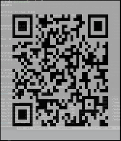

# RQRCode


[RQRCode](https://github.com/whomwah/rqrcode) is a library for creating and rendering QR codes into various formats. It has a simple interface with all the standard QR code options. It was adapted from the Javascript library by Kazuhiko Arase.

* QR code is trademarked by Denso Wave inc
* Minimum Ruby version is `>= 2.3`
* For `rqrcode` releases `< 1.0.0` please use [this README](https://github.com/whomwah/rqrcode/blob/cd2732a68434e6197c219e6c8cbdadfce0c4c4f3/README.md)

## Installing

Add this line to your application's `Gemfile`:

```ruby
gem 'rqrcode'
```

or install manually:

```ruby
gem install rqrcode
```

## Basic usage example

```ruby
require 'rqrcode'

qr = RQRCode::QRCode.new('http://github.com')
result = ''

qr.qrcode.modules.each do |row|
  row.each do |col|
    result << (col ? 'X' : 'O')
  end

  result << "\n"
end

puts result
```

### Advanced Options

These are the various QR Code generation options provided by [rqrqcode_core](https://github.com/whomwah/rqrcode_core).

```
string - the string you wish to encode

size   - the size of the qrcode (default 4)

level  - the error correction level, can be:
  * Level :l 7%  of code can be restored
  * Level :m 15% of code can be restored
  * Level :q 25% of code can be restored
  * Level :h 30% of code can be restored (default :h)

mode   - the mode of the qrcode (defaults to alphanumeric or byte_8bit, depending on the input data):
  * :number
  * :alphanumeric
  * :byte_8bit
  * :kanji
```

Example

```
qrcode = RQRCodeCore::QRCode.new('hello world', size: 1, level: :m, mode: :alphanumeric)
```

## Render types

You can output your QR code in various forms. These are detailed below:

### as SVG

The SVG renderer will produce a stand-alone SVG as a `String`

```ruby
require 'rqrcode'

qrcode = RQRCode::QRCode.new("http://github.com/")

# NOTE: showing with default options specified explicitly
svg = qrcode.as_svg(
  offset: 0,
  color: '000',
  shape_rendering: 'crispEdges',
  module_size: 6,
  standalone: true
)
```

SVG only options: 

```ruby
  viewbox        - replace height, width in <svg> with a viewBox, allows CSS scaling
  svg_attributes - a Hash, valid keys are `:id` and `:class`, e.g. `svg_attributes: {id: '123'}`, adds id and/or class attributes
```


### as ANSI

The ANSI renderer will produce as a string with ANSI color codes.

```ruby
require 'rqrcode'

qrcode = RQRCode::QRCode.new("http://github.com/")

# NOTE: showing with default options specified explicitly
svg = qrcode.as_ansi(
  light: "\033[47m", dark: "\033[40m",
  fill_character: '  ',
  quiet_zone_size: 4
)
```



### as PNG

The library can produce a PNG. Result will be a `ChunkyPNG::Image` instance.

```ruby
require 'rqrcode'

qrcode = RQRCode::QRCode.new("http://github.com/")

# NOTE: showing with default options specified explicitly
png = qrcode.as_png(
  bit_depth: 1,
  border_modules: 4,
  color_mode: ChunkyPNG::COLOR_GRAYSCALE,
  color: 'black',
  file: nil,
  fill: 'white',
  module_px_size: 6,
  resize_exactly_to: false,
  resize_gte_to: false,
  size: 120
)

IO.binwrite("/tmp/github-qrcode.png", png.to_s)
```


### On the console ( just because you can )

```ruby
require 'rqrcode'

qr = RQRCode::QRCode.new('http://kyan.com', size: 4, level: :h)

puts qr.to_s
```

Output:

```
xxxxxxx   x x  xxx    xxxxxxx
x     x  xxxxx  x x   x     x
x xxx x    x x     x  x xxx x
x xxx x  xxx  x xxx   x xxx x
x xxx x xxx  x  x  x  x xxx x
... etc
```

## API Documentation

[http://www.rubydoc.info/gems/rqrcode](http://www.rubydoc.info/gems/rqrcode)

## Tests

You can run the test suite using:

```
$ ./bin/setup
$ bundle exec rspec
```

or try the lib from the console with:

```
$ ./bin/console
```

## Contributing
* Fork the project
* Send a pull request
* Don't touch the .gemspec, I'll do that when I release a new version

## Authors

Original RQRCode author: Duncan Robertson

A massive thanks to [all the contributors of the library over the years](https://github.com/whomwah/rqrcode/graphs/contributors). It wouldn't exist if it wasn't for you all.

Oh, and thanks to my bosses at https://kyan.com for giving me time to maintain this project.

## Resources

* wikipedia:: http://en.wikipedia.org/wiki/QR_Code
* Denso-Wave website:: http://www.denso-wave.com/qrcode/index-e.html
* kaywa:: http://qrcode.kaywa.com

## Copyright

MIT License (http://www.opensource.org/licenses/mit-license.html)
